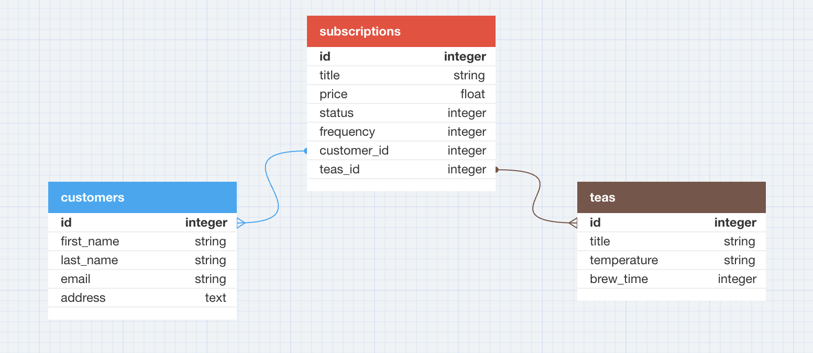

## Overview

Tea Subscription is a Ruby on Rails back-end application that exposes API's.  It will allow users to activate tea subscriptions.  Working within a service-oriented architecture, the back-end developer's role is to facilitate API communication between the front-end.
<div align="center">
  <a href="https://github.com/AI-Project-Planner/project_planner_be">
    

<!-- [table diagram](https://dbdiagram.io/d/645986badca9fb07c4b9e033)<br> -->

## Table of Contents
<!-- - [Learning Goals](#learning-goals) -->
- [How To Install](#how-to-install)
- [Endpoints](#endpoints)
- [Tech Stack](#tech-stack)

<!-- ## Learning Goals -->

## How To Install

_Follow the steps below to install and set up this app._

1. Clone this Repository
   ```sh
   git clone git@github.com:amspears007/tea_subscription.git
   ```
2. In your terminal, run the following commands;
    ```sh
    bundle install
    rails db:{drop,create,migrate,seed}
    ```

    <p align="right">(<a href="#readme-top">back to top</a>)</p>

<br />


## Endpoints

<!-- <details close> -->

<br> Create A subscription
```http
POST /api/v1/customers/:id/subscriptions
```

<br> Get all subscriptions
```http
GET /api/v1/customers/:id/subscription/
```

Update a Suscription

```http
PATCH /api/v1/customers/:customer_id/subscriptions/:subscription_id/
```

<!-- </details> -->

## Tech Stack

<!-- This README would normally document whatever steps are necessary to get the
application up and running.

<!-- Things you may want to cover:

* Ruby version

* System dependencies

* Configuration

* Database creation

* Database initialization

* How to run the test suite -->

<!-- * Services (job queues, cache servers, search engines, etc.) -->

<!-- * Deployment instructions -->

<!-- * ... -->
